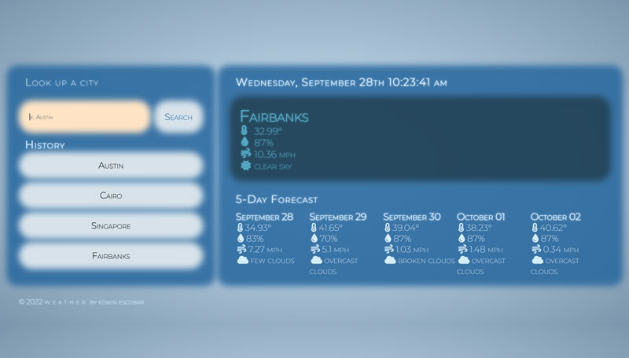
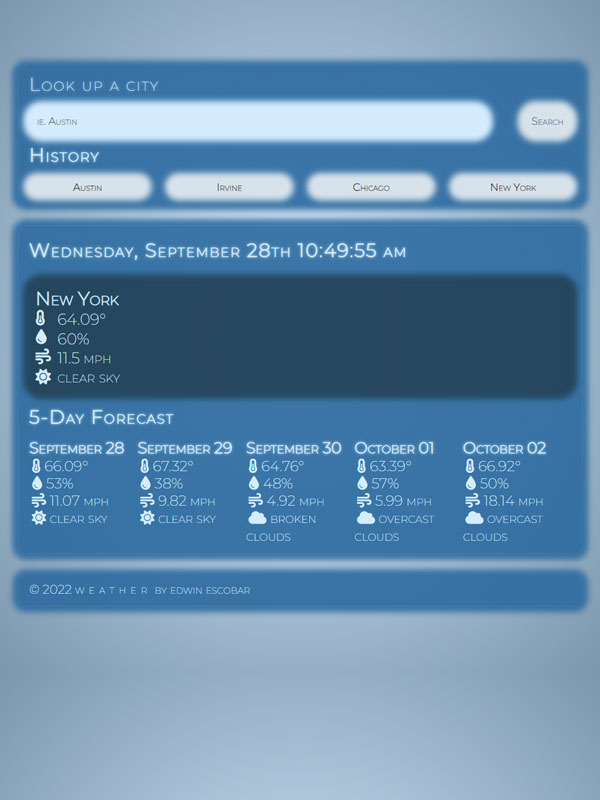
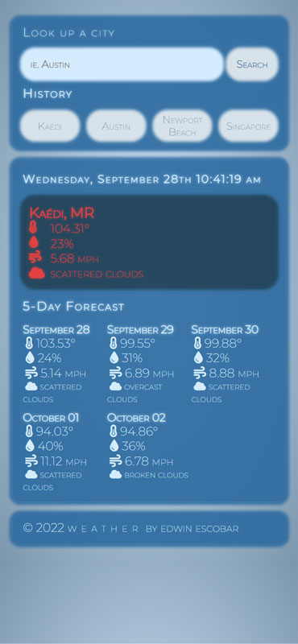

# weather-dashboard

  * [Repo](https://github.com/escowin/weather-dashboard)

  * [Live URL](https://escowin.github.io/weather-dashboard)
  
## Description

  whether or not you know it, you'll know the weather conditions now & for the next 5 days

## Languages

  HTML, CSS, JavaScript, Moment.js

## Table of Contents

  * [Usage](#usage)
  
  * [Screenshots](#screenshots)

  * [Author](#author)

## Usage

  Look up weather for any desired city

## Screenshots
  
  
  
  

## Author

  Edwin Escobar

  * [Email](mailto:edwin@escowinart.com)

  * [GitHub](https://github.com/escowin)
